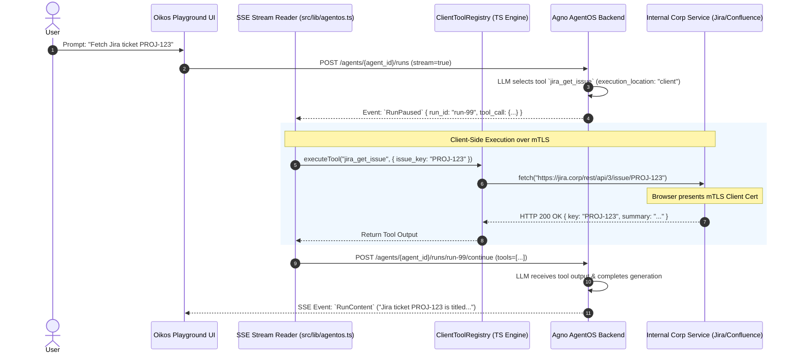

# Client-Side (Deferred) Tool Execution & mTLS Integration Research

## Overview

In enterprise deployments of Agno AgentOS, agents often need to interact with internal corporate services such as **Jira, Confluence, and GitLab**. In many corporate environments, these internal systems require **Mutual TLS (mTLS)** client certificate authentication.

Because mTLS client certificates are installed locally on user workstations and browsers (macOS Keychain, Windows Certificate Store), central AgentOS backend servers cannot directly connect to these endpoints. 

To overcome this network and security boundary, tool execution is **deferred** from the backend runtime to the **Oikos web UI frontend**, leveraging the user's browser TLS stack.

All API routes and schemas defined herein strictly adhere to the official AgentOS OpenAPI specification ([`data/openapi.json`](file:///Users/dselck/Documents/Oikos/data/openapi.json)).

---

## 1. Browser mTLS & Network Restrictions

### How mTLS Works in Web Browsers
When a web browser makes an HTTPS request to an mTLS-protected endpoint (e.g. `https://jira.corp.internal/rest/api/3/issue/PROJ-123`), the underlying OS/browser networking stack automatically manages the TLS handshake:
1. Server presents server certificate.
2. Server requests client certificate.
3. Browser accesses the client certificate stored in the OS Keychain / Certificate Store (or prompts the user to choose a certificate).
4. Handshake succeeds and encrypted HTTP communication begins.

### WebAssembly (WASM) Sandbox Limitations
WebAssembly executed inside a web browser is strictly sandboxed by the browser engine. 
- **No Raw TCP/TLS Sockets**: WASM modules cannot open raw TCP sockets or perform low-level TLS handshakes directly.
- **Dependency on Browser APIs**: All WASM networking (whether from Pyodide/Python, Rust, or Go) MUST be proxied back through browser Web APIs (`fetch()` or `XMLHttpRequest`).
- **Implication**: WASM provides no network capability advantage over JavaScript/TypeScript for mTLS. All runtimes rely on the browser's native `fetch()` engine to present client certificates.

---

## 2. Technical Evaluation of Candidate Runtimes

| Feature / Criterion | **JavaScript / TypeScript (Selected)** | **Pyodide (Python in WASM)** | **Compiled Rust (WASM)** | **Compiled Go (WASM / TinyGo)** |
| :--- | :--- | :--- | :--- | :--- |
| **Primary Advantage** | Zero-latency (<1ms), 0 KB bundle overhead, native browser mTLS, native Next.js/React integration. | 100% direct code reuse of Agno's Python `JiraTools`, `ConfluenceTools`, `GitLabTools`. | High-performance compiled execution & strict memory safety. | Rich Go client SDKs (`go-jira`, `go-gitlab`) and standard concurrency. |
| **mTLS Networking** | **Native**: `fetch()` uses the browser TLS stack & OS Keychain client certificates directly. | **Via JS Proxy**: Python `requests`/`httpx` must be patched (`pyfetch`) to route through browser `fetch()`. Raw sockets are blocked. | **Via JS Proxy**: `web-sys::fetch` routes through browser `fetch()`. Raw sockets are blocked. | **Via JS Proxy**: `net/http` patched with JS `fetch` transport. |
| **Bundle / Transfer Size** | **0 KB** (Included in app bundle). | **~30MB - 50MB** (CPython VM + stdlib + wheel downloads). | **~1.5MB - 4MB** (Gzipped WASM binary). | **~2MB - 8MB** (TinyGo / Go WASM binary). |
| **Cold Start / Latency** | **< 1 ms** (Instant execution). | **2.5s - 6s** (Cold boot of Pyodide WASM runtime). | **50ms - 150ms** (WASM module loading). | **80ms - 200ms** (Go runtime setup). |
| **Library Availability** | **Extensive**: `@atlassian/jira-software-cloud-api`, `@gitbeaker/rest`, native REST/GraphQL APIs. | **Extensive**: `atlassian-python-api`, `python-gitlab`, Agno tools. | **Moderate**: `jira-rs`, `gitlab` crates, or custom `reqwest` wrappers. | **Extensive**: `andygrunwald/go-jira`, `xanzy/go-gitlab`. |
| **Developer Experience** | Standard Chrome/Firefox DevTools, native source maps, simple async/await. | Complex JS-Python async bridge, stack trace truncation across boundary. | Requires `wasm-pack`, rustc, and `wasm-bindgen` build steps. | Requires Go/TinyGo WASM toolchain & glue code. |

---

## 3. OpenAPI Standard Protocol Alignment (`data/openapi.json`)

Deferred tool execution maps directly to existing AgentOS OpenAPI endpoints:

1. **`POST /agents/{agent_id}/runs`**:
   Starts an agent run. When `stream=true`, AgentOS streams SSE events. When a deferred tool is invoked, AgentOS pauses the run and emits an SSE event:
   ```json
   {
     "event": "RunPaused",
     "run_id": "run-9876",
     "session_id": "sess-5432",
     "tool_call": {
       "id": "call_abc123",
       "name": "jira_get_issue",
       "args": { "issue_key": "PROJ-101" }
     }
   }
   ```

2. **`POST /agents/{agent_id}/runs/{run_id}/continue`**:
   Resumes the paused agent run with client-side tool execution results. Passes form parameter `tools` containing the JSON-serialized array of tool results:
   ```json
   [
     {
       "tool_call_id": "call_abc123",
       "status": "success",
       "content": {
         "key": "PROJ-101",
         "summary": "Fix authentication bug in auth service",
         "status": "In Progress"
       }
     }
   ]
   ```

3. **`POST /components` & `POST /components/{component_id}/configs`**:
   Registers tool components with metadata (`"execution_location": "client"`).

---

## 4. Protocol Sequence Diagram



---

## Conclusion

The **JavaScript/TypeScript Client Tool Engine** strictly utilizes standard AgentOS OpenAPI endpoints (`/agents/{agent_id}/runs` and `/agents/{agent_id}/runs/{run_id}/continue`), avoiding custom non-spec routes.
